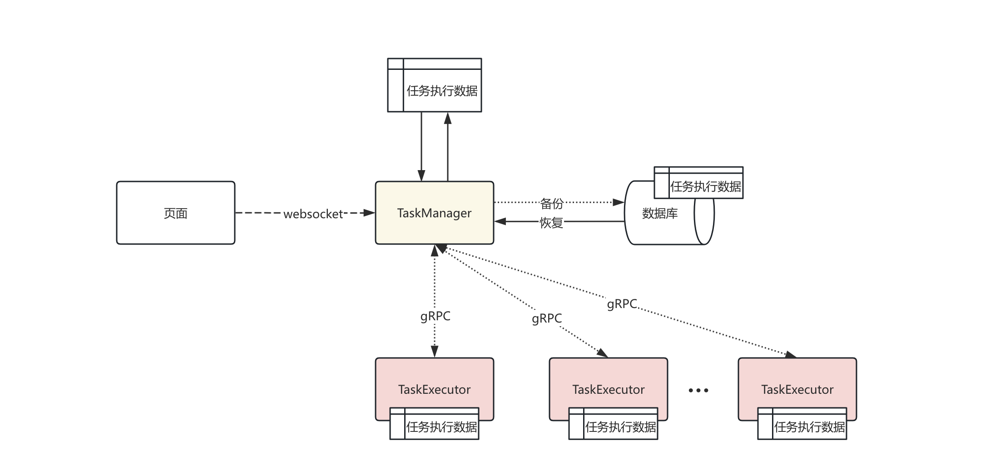
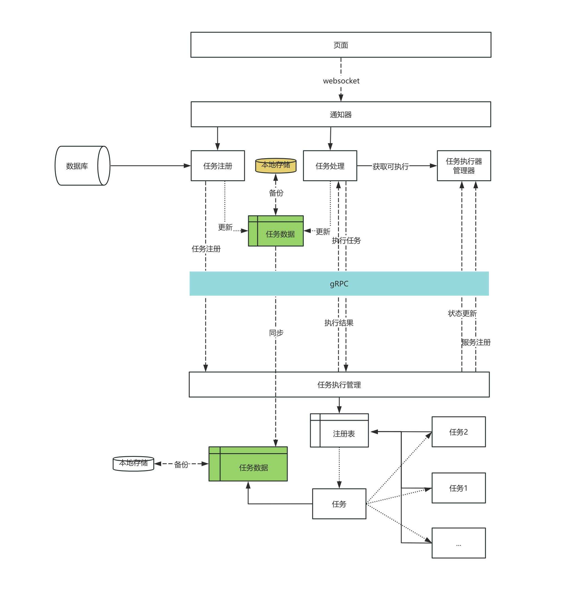
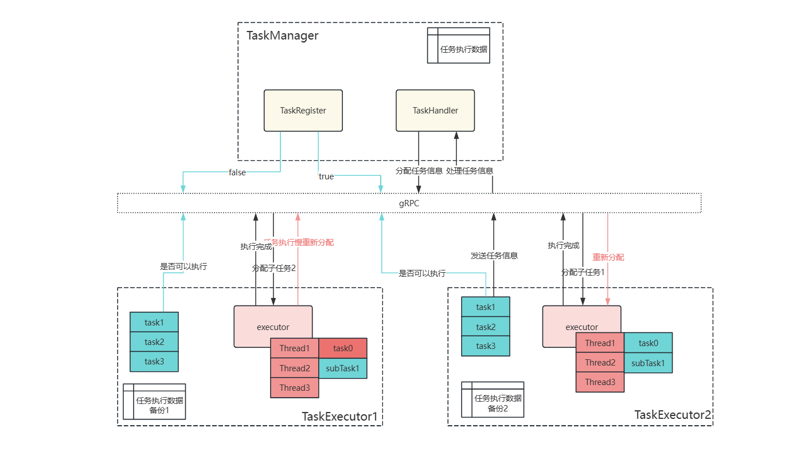
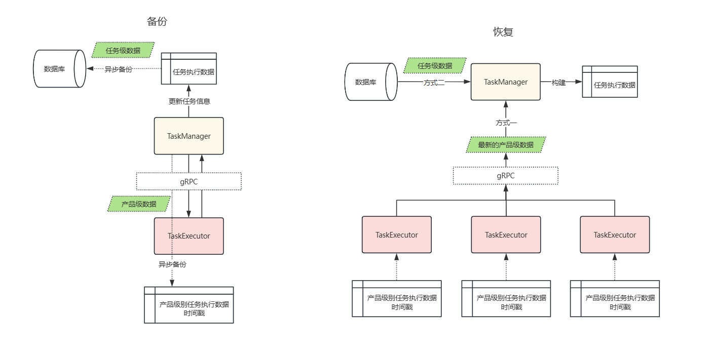

# 任务流设计文档

## 1. 设计目的

### 1.1. 设计背景

出于对原系统的结构设计的不理解，以及对自己能力的要求，想对于原系统进行一个新的设计是否会优于原系统，以下原系统的几个关键的设计结构是与我想法完全不一致的：
1. 大量循环请求，如前端循环请求后端，获取任务执行信息，以达到信息实时更新，后期无任何想法对此进行优化；
2. 核心逻辑切分过细，业务逻辑丝毫不做切分；个人认为核心代码，尽量处于一块，且代码不会有更多变动所以不考虑后续迭代，但是保证易读性，业务代码修改过多，但是代码丝毫不切分，大量重复代码，以致bug 重复修改；（可能初期设计代码较少没有意识到处于核心设计中，后续人员扩大，无法控制每个人，导致都写属于自己的代码）；
3. 日志功能，核心代码日志不断的定时刷新，另外引用组件日志也在不断刷新，提高日志等级之后还是在控制台刷新，个人代码日志完全不可见，服务器磁盘经常处于爆满状态；
4. 代码无法自测，存在传参地狱，一个参数不断的传递，单独类设计完全处于面向流程，不同流程进行方法分割，参数传递始终需要原始参数，导致自测需要构造一个处于完全形态的系统几近启动全部服务，自测代价太大（开发会偷懒）
处于对上述问题的解决，考虑一个别样的设计，锻炼自己的系统整体构造能力

### 1.2. 当前设计

1. 前端定时请求后端，读取后端任务状态信息；
2. 当前任务注册执行启动，注册基于定时任务不断访问，先判断当天任务是否需要执行，持久化对应任务到数据库，分为展示任务表，执行任务表，步骤表和分片任务表四个核心表来，前端动态显示任务执行按钮，任务执行通过前端按钮进行触发，代理父任务类，独特注解标识任务，启动核心的几个方法，来执行任务，每次只执行一个任务，但是任务部分步骤基于key 分割可以切分子任务，放入子任务执行器，一个基于线程池，执行任务开发的组件，然后执行提供并发，提高效率，任务执行完成之后更新数据库，定时任务读取数据库判断任务结束，更新任务状态，前端显示下一个任务的执行按钮，以此不断执行，任务首次初始化，手动插入一条任务注册任务，借此触发其他任务注册，后续结束任务在注册下一天的注册任务；
3. 并发控制，原则上只依赖数据库控制并发，因为数据库是唯一独立于分布式系统的单一系统，没有其余依赖组件系统（redis 被任务不太稳定）；
4. 系统分为批处理服务，实时交易服务，管理台服务，流程管理服务，网关服务，管理台也就是页面基础增山查改功能、数据导出功能和配置化功能，实时交易服务提供了接口进行一些在线的柜台交易，主要在于批处理服务，可以定时按照时间执行对应任务（虽然我从来没用过），业务在此就不细述，主要是大批量处理数据、上下游异步交流、数据核查等；

## 2. 实现目标

1. 前端后端websocket 连接获取任务执行信息；
2. 任务管理和任务执行分离，任务执行可以保证水平扩展，注册到对应任务管理服务中即可扩展性能，任务管理负责对接前端、维护任务执行状态、管理执行服务；
3. 后端服务之间通过gRPC 交互提高效率，减少请求握手时间；
4. 任务数据使用额外数据结构存储内存，放弃使用数据库；
5. 任务执行可以同时在不同的服务之间执行，而不是单服务多线程执行，子任务于任务同级别，基于任务管理器分配；
6. 代码解耦，方法测试；
7. 代码容错，任务数据可持久化，方便任务恢复；
8. 步骤级别的任务控制，任务步骤可以在多个任务执行服务之间运行；（可选）

## 3. 架构设计

### 3.1. 主体架构

  
    
系统分为两大主体，`TaskManager`和`TaskExecutor`，`TaskManager` 提供基础功能，对接前端，管理`TaskExecutor`和维护任务状态和系统状态功能，`TaskExecutor`主要负责执行任务并提供水平扩展功能提高执行效率；  
服务之间内部交互通过`rpc`协议，减少握手交互时间，任务数据采用独特的数据接口，存储在内存中，保证高效率的获取任务信息，并做了多重备份以方便程序稳定性；

### 3.2. 基础任务数据结构

#### 3.2.1 产品数据

|字段|类型|名称|描述|
|:-------:|:-----:|:----:|:-----------|
|prod_code|String|产品代码|略|
|prod_name|String|产品名称|略|
|parent_prod_code|String|父产品名称|略|
|prod_mode|int|产品模式|封闭净值、开放净值、货币净值、周期净值|
|prod_lifecycle|int|产品状态|设计、发行前、发行、发行失败、成立、封闭、开放、到期、终止|

#### 3.2.2. 销售商数据

|字段|类型|名称|描述|
|:-------:|:-----:|:----:|:-----------|
|distribute_code|String|销售商代码|略|
|distribute_name|String|销售商名称|略|
|distribute_type|int|销售商类型|直销、传统代销、互联网代销|

#### 3.2.3. 任务数据

|字段|类型|名称|描述|
|:-------:|:-----:|:----:|:-----------|
|task_id|String|任务id|略|
|task_name|String|任务id|略|
|task_type|int|任务类型|系统级、产品级、销售商级|
|in_lifecycle|int|任务类型|系统级、产品级、销售商级|
|status|int|任务状态|未注册,注册,未执行,执行中,执行失败,执行成功,跳过|

### 3.3. 主要模块

### 3.3.1 gRPC 通信模块

后端之间的通信，交互任务信息

1. 数据恢复需要一个rpc,对应的数据结构貌似要序列化不然不好传递，这个流式传递
2. 启动，回滚任务需要一个， 不同的标记发送过去，就不弄多个rpc了，双向吧，异步成功通知
3. 判断任务是否可以执行，双向
4. 

### 3.3.2. 任务数据模块

收集任务处理状态，如当前任务处理到哪，一个本地存储功能，（主要是不依赖数据库，太慢）

* 线程安全
* 简单的访问
* 频繁读取更新
* 高性能
* 可备份
* 定期持久化, 支持文件, 支持数据库
* 通过task id 知道下一个可执行的task或者group
* 状态机?
* 邻接表 + hash 索引

#### 3.3.1. 任务注册模块

`TaskManager` 主要负责任务的注册和处理，`TaskExecutor` 只需要负责执行，`TaskManager` 需要保证线程安全，注册任务时多个`TaskExecutor` 会出现抢夺，由率先注册完成的服务发起后续逻辑，传递任务信息给`TaskHandler` ，判断任务是否可以分片，不能分片需要上发到`TaskHandler` 吗？如果可以分片由`TaskHandler` 将任务分割为子任务之后分发给不同的`Executor` 再控制线程执行当前任务；不同的产品如何去不停的注册任务

当前需要解决，如果多个产品都需要注册同一个任务，那么executor 如何知道哪些产品需要注册，还是说executor 只负责注册，不负责判断哪些产品，直接给manager 注册多个，但是不同产品它也许在不同条件下注册，否决

多次交流，任务可以注册了，你还要判断产品要注册哪些，我manager 负责把产品发给你？两次网络不如循环
我们先理清楚，任务注册是需要哪些条件

1. 按照时间 不算
2. 只有部分类型的产品
3. 符合条件的销售商

附带产品列表、销售商列表，我要的是信息

实际来说，任务注册就是在判断哪些产品销售商符合条件，我貌似只需要返回产品、销售商列表就行、特定日期

注册任务信息包含： 任务id、产品销售商列表、注册时间 选用这个方案

产品销售商 需要清算，而不是清算需要产品

一次网络请求，但是需要附带哪些产品需要注册返回给manager 让他去判断，这部还是相当于循环了吗

如何触发任务注册，也就是manager 如何知道哪一个任务该注册了
按照原来的，到达一个时间节点或者任务执行完成之后通知下一个任务注册
第一次注册如何解决？
每次程序启动都会插入一条隐藏的任务，然后manager 通知 executor 领取任务执行，这个任务负责注册初始化任务，如果说在启动的时候，executor 没有启动，表示gRpc 需要有延迟等待的策略

### 3.3. 任务通知器

主要是发布事件给其他处理器消费，比如事件节点，或者任务执行完成，通知下一个任务子还行
两种方案：Spring 的注解，或者自己实现发布订阅模型
由于spring 注解需要反射，考虑性能采用自己实现发布订阅模型
并且需要事件多对多的订阅，订阅多个，消费多个
事件：  

* 定时任务根据时间间隔配置发布一次时间事件，触发判断任务注册
* 通过websocket 上一任务执行，触发下一个任务注册，更新任务状态
* websocket 执行事件
* websocket 停止事件
* websocket 跳过事件

### 3.4. 执行器管理

任务处理器的状态管理

### 3.5. 任务处理

任务对接外层， 包含rpc，启动器
如何解决manager 如何启动对应任务，原先是开发了一个注解，然后动态代理启动对应任务；
当前的解决办法是，启动一个命令模式，调用对应方法一键执行，类似线程的方式，初始化对应的类直接调用start 的方式
只能用反射的方式在能说在运行时加载对应的类
或者类似注册表的机制，（这个），使用延迟加载的机制还能保证所有任务不会全部在内存中，执行完注销掉类

任务备份也跟任务数据处理器一样的数据结构只需要存储，不需要对外访问；
数据核对和恢复如何处理
似乎还要对接shardingjdbc，这个就省略吧，对接数据库层次做的开放点
其次如何实现步骤级别的控制，扩展标记，如何知道有多少步骤,暂时直接用子类的switch 实现，或者干脆没有步骤，只有一个个方法，组成一个步骤在switch 中， 这样会太多还是算了

### 3.4. 备份设计

任务执行信息的备份，备份的主要保证尽快恢复所有系统已经执行的任务且不影响主要任务执行，当前备份粒度级别暂时定为任务级别，即恢复之后停留在最近一个已经执行完的任务，下一个任务待执行，下一个任务已经执行的话，但是没有最终确认，放弃其所修改的全部数据；
数据库备份执行任务级别备份，还可以通过下发给所有`TaskExecutor` 提供任务执行信息，作为进程级别备份，一旦`TaskManager` 中断取所有节点中最新的一份任务执行信息，且任务执行信息中包含任务执行到哪一个步骤及产品或者账号字段，保证最新恢复可以直接使用；
> 当前就需要引入二次确认的流程，数据在被任务再修改中或者修改完成但是还没有备份完成的状态时服务停止，数据会处于一个特殊的状态，方便进行恢复;

采用订阅式的模式，任务中心只提供所有任务的信息，如已执行，未执行，和当前时间点，每个任务触发去任务中心判断自己是否需要注册的方式是通过spring 的AOP 切面设计，在每个任务执行完成之后调用触发；
可扩展性，需要考虑有多个任务执行注册服务，所以需要实现选举，选举出一个主节点，参考zookeeper？gRPC 实现节点之间的通信，交互任务状态；
主节点的备份逻辑，时间窗口？节点窗口？水位线？下一个任务比上一个任务的状态先到达？？
任务注册和任务执行一定要一个服务么？？？这样就可以说不用考虑选举了？？
flink 通过实现不同的任务类型，解析成为node（vertex） 或者edge，然后加入集合进行分配执行（这里有点不同如何去分配的），其次就是任务执行的配置优化，可以自动化，识别出最好的执行配置，再就是对于同源任务即在同一个slot 下的任务，只能串行执行（每次只能执行单个任务）就存在热点机器执行慢或者其他情况，flink 的解决方式是在另一个slot 创建一个相同的任务，去最快执行结束的结果，慢的取消；
当前系统的基础是，我的任务执行图已经固定，需要flink 来实现一个个图吗；

## 4. 代码逻辑

## 5. 性能分析

## 6. 结果分析

    抛弃不断扫描的逻辑，通过触发式的逻辑来注册任务，帮助减少性能损耗，第二就是通过websocket 长连接来与前端交互，最后就是实现本地缓存，快速执行任务和状态更新，数据库承担备份作用，防止突然中断，保证数据恢复；中断不同情况的考虑；
    图数据结构？（目前个人感觉适合非结构化数据，结构化数据用数据库可能来的更快一些）
    可以有优化任务执行逻辑吗，比如我的数据是一样的，在同一个节点，所以我可以复用这些数据，
