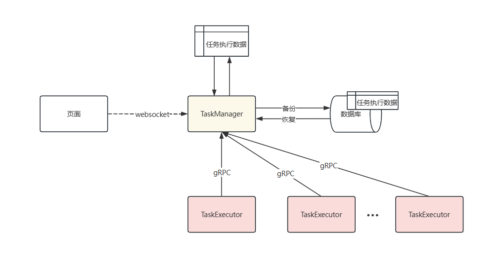

# 任务流设计文档

## 1. 设计目的

### 1.1. 设计背景

出于对系统代码的主要逻辑是通过定时任务不断获取数据库的任务执行信息，判断之后进行任务注册，前端也是通过不断请求刷新页面的任务状态，对于自己开发代码和调试代码，首当其冲的就是日志不断地刷新的控制台，任务执行报错信息会被淹没，日志组件打印大部分都是info，就算把也关闭还有依赖组件执行sql 打印的日志，其次就是任务注册性能消耗过大，内网运行全部服务之后，内存基本不剩下，需要控制jvm 占用内存，第三点是代码逻辑切分，主观认为核心代码，基本不会有变动，不需要大量的类来实现细分功能，代码逻辑跳跃大，比较难以理解，但是业务逻辑却混为一个类，长期写重复代码，导致这个功能正常了，另一个功能因为代码单独实现一样的逻辑也会出现问题。
额外的存在的问题在于对于日志模块重视程度不足，任务执行的日志处于快速增加，测试环境需要不断地删除日志，和任务类基本没有自测切入点，每一个方法都需要构建一个完完整整的请求来模拟，没有方便的切入空间，导致自测成本需要每次运行系统，需要走大量的不必要的流程来进行自测；

### 1.2. 当前设计

任务注册逻辑基于一个展示表和一个执行表和一个定时任务三者来达到任务注册，系统首先获取当前需要执行的所有任务，存入到展示表，再基于展示表的任务信息，根据系统参数控制如何注册任务，再通过对应任务实现的任务注册方法，判断是否需要注册，再插入到任务执行表中，系统中存在两个特别任务，启动和切换到下一天，其中启动为了兼容再任务注册过程中出现中途修改数据，导致任务注册与预期对应不上，所以启动有条件的兼备第一次任务展示的逻辑，后续任务基于第一次判断后台隐式的执行注册执行逻辑；
并发控制主要通过redis 的锁来防止多个服务同时注册和注册同一个任务和把所有任务注册数据存入数据库由数据库的事务和线程控制进行任务抢夺执行，其中部分任务能够被分为多个子任务；

## 2. 实现目标

1. 分离任务注册和任务执行，任务注册服务轻量化，只提供公共信息，任务需要自己反向找任务注册服务判断自己所需的前置或者后置条件是否达到，同时任务执行信息反馈到任务注册，消除循环和定时任务；
2. 其二维护一个本地缓存和websocket，提供实时交互，消除前端循环请求和提供任务执行速度；
3. 任务注册节点不断持久化任务执行情况，异步执行，确保不会影响当前任务执行；
4. 任务注册服务和任务执行服务之间通过gRPC 进行通信；
5. 类设计上解耦方便单元测试

## 3. 架构设计

### 3.1. 主体架构

主体设计围绕着`TaskManager` 来获取任务有关信息，`TaskManager` 主要提供任务注册、执行信息统计、与前端交互和备份数据等主体功能，任务的执行主要是通过`TaskExecutor` 来执行，然后通过`gRPC` 把任务执行信息返回给`TaskManager` 然后`TaskExcutor` 中的任务获取执行条件是否达到如时间点、前置后置任务等是否执行；

### 3.2. 任务注册执行设计

`TaskManager` 主要负责任务的注册和处理，`TaskExecutor` 只需要负责执行，`TaskManager` 需要保证线程安全，注册任务时多个`TaskExecutor` 会出现抢夺，由率先注册完成的服务发起后续逻辑，传递任务信息给`TaskHandler` ，判断任务是否可以分片，不能分片需要上发到`TaskHandler` 吗？如果可以分片由`TaskHandler` 将任务分割为子任务之后分发给不同的`Executor` 再控制线程执行当前任务；不同的产品如何去不停的注册任务

### 3.3. 备份设计

任务执行信息的备份，备份的主要保证尽快恢复所有系统已经执行的任务且不影响主要任务执行，当前备份粒度级别暂时定为任务级别，即恢复之后停留在最近一个已经执行完的任务，下一个任务待执行，下一个任务已经执行的话，但是没有最终确认，放弃其所修改的全部数据；
数据库备份执行任务级别备份，还可以通过下发给所有`TaskExecutor` 提供任务执行信息，作为进程级别备份，一旦`TaskManager` 中断取所有节点中最新的一份任务执行信息，且任务执行信息中包含任务执行到哪一个步骤及产品或者账号字段，保证最新恢复可以直接使用；
> 当前就需要引入二次确认的流程，数据在被任务再修改中或者修改完成但是还没有备份完成的状态时服务停止，数据会处于一个特殊的状态，方便进行恢复;

采用订阅式的模式，任务中心只提供所有任务的信息，如已执行，未执行，和当前时间点，每个任务触发去任务中心判断自己是否需要注册的方式是通过spring 的AOP 切面设计，在每个任务执行完成之后调用触发；
可扩展性，需要考虑有多个任务执行注册服务，所以需要实现选举，选举出一个主节点，参考zookeeper？gRPC 实现节点之间的通信，交互任务状态；
主节点的备份逻辑，时间窗口？节点窗口？水位线？下一个任务比上一个任务的状态先到达？？
任务注册和任务执行一定要一个服务么？？？这样就可以说不用考虑选举了？？
flink 通过实现不同的任务类型，解析成为node（vertex） 或者edge，然后加入集合进行分配执行（这里有点不同如何去分配的），其次就是任务执行的配置优化，可以自动化，识别出最好的执行配置，再就是对于同源任务即在同一个slot 下的任务，只能串行执行（每次只能执行单个任务）就存在热点机器执行慢或者其他情况，flink 的解决方式是在另一个slot 创建一个相同的任务，去最快执行结束的结果，慢的取消；
当前系统的基础是，我的任务执行图已经固定，需要flink 来实现一个个图吗；

## 4. 代码逻辑

## 5. 性能分析

## 6. 结果分析

    抛弃不断扫描的逻辑，通过触发式的逻辑来注册任务，帮助减少性能损耗，第二就是通过websocket 长连接来与前端交互，最后就是实现本地缓存，快速执行任务和状态更新，数据库承担备份作用，防止突然中断，保证数据恢复；中断不同情况的考虑；
    图数据结构？（目前个人感觉适合非结构化数据，结构化数据用数据库可能来的更快一些）
    可以有优化任务执行逻辑吗，比如我的数据是一样的，在同一个节点，所以我可以复用这些数据，
